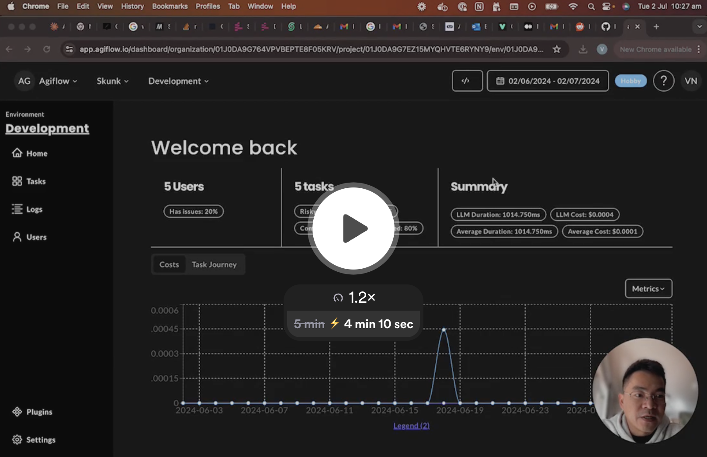

<div align="center">


# **AGIFlow**

🤖 **AGIFlow**: LLM QA and Observability. We streamline LLM and Agentic Workflow development with real-time tracing and a visual debugger. Easily test prompt and model performance while continuously monitoring performance in production.

[Homepage](https://agiflow.io/) | [Documentation](https://docs.agiflow.io/) | [Architecture and Data Security](./docs/architecture.md) | [Discord](https://discord.gg/KCMyce2J) | [Newsletter](https://mailchi.mp/agiflow/agiflow-sub)

</div>

## Table of contents

- [Why AGIFlow?](#why-agiflow)
- [Getting Started](#getting-started)
- [Key Features](#key-features)
- [Contribution](#contribution)
- [License](#license)
- [Support](#support)

## Why AGIFLow?


[](https://www.loom.com/share/d2e4fcb3b7c847ec8bc752f48a644570)


With automatic logging and detailed traces, AGIFlow optimizes performance and resolves issues efficiently. Additionally, its intuitive dashboards accelerate QA and feedback loops, boosting team productivity and reducing training time. We understand the challenges of bringing your LLM app to production and want to ensure you have a [scalable, trustworthy infrastructure](./docs/architecture.md) to do so.

## Getting Started

Running Agiflow app locally using `docker compose` and start tracing your application by:

1. **Clone the Repository**:
```bash
git clone https://github.com/AgiFlow/agiflow-sdks.git
cd agiflow-sdks
```

2. **Run the development app**: 
```bash
cd dockers/dev
docker-compose up
```

3. **Install Dependencies**:
Go to `localhost:3000` to get the API key and follow [this documentation](https://docs.agiflow.io/python) to get telemetry from your LLM app to Agiflow dashboard. With `docker compose` development setup, the `AGIFLOW_API_ENDPOINT` is `http://localhost:3000/api/analytics`.

## Key Features

Our mono-repo is designed with the goal of building robust and scalable LLM ops platform. To learn more about why and how we use mono-repo, please visit [Nx, PNPM and Poetry Mono-Repo documentation](./docs/mono-repo.md).  

We're making sources available on a rolling basis from our internal repo. For comprehensive documentation, please visit [AGIFlow's docs](https://docs.agiflow.io). Here is an overview of our packages:

- [x] **dockers**: Docker compose to run and self-host AGIFlow.
- [x] **[llm-mocks](https://docs.agiflow.io/llm-mocks)**: Mocking library for LLM providers, simplifying TDD, reducing CI/CD costs on regression testing, and facilitating API development.
- [x] **[agiflow-eval](https://docs.agiflow.io/python-agiflow-eval)**: Python SDK for LLM evaluations, supporting custom templates and multiple models.
- [x] **[agiflow-sdk](https://docs.agiflow.io/python)**: Python SDK built on top of Open-Telemetry to collect LLM metrics, supporting prompt and model registry synchronization for multiple LLM usages.
- [ ] **[@agiflow/js-sdk](https://docs.agiflow.io/web)**: Web SDK for frontend analytics on how users interact with LLM apps, allowing full-stack traceability.
- [ ] **[@agiflow/web-feedback](https://docs.agiflow.io/web/feedback)**: Feedback widget with session replay and workflow visualization to get high-quality feedback from simple chat apps to complex agentic workflows.


## Contribution

We welcome contributions from the community! If you would like to contribute, please follow [this guide](./Contribution.md).

## License

This repository is a mono-repo that contains various packages, modules, and applications, each of which may be governed by different licenses. Unless otherwise explicitly stated within the respective package, module, or application subdirectory, the code in this repository is licensed under the Business Source License (BSL). For more details, refer to the [License Notice](./LICENSE).

## Support

If you have any questions or need support, please open an issue in this repository or contact our support team at vuong@agiflow.com.

To stay updated, get support, and engage with fellow developers, join our [Discord community](https://discord.gg/KCMyce2J). Click the link below to connect with us and be part of the conversation!

Thank you for using AGIFlow SDKs! We look forward to seeing the amazing things you build.
