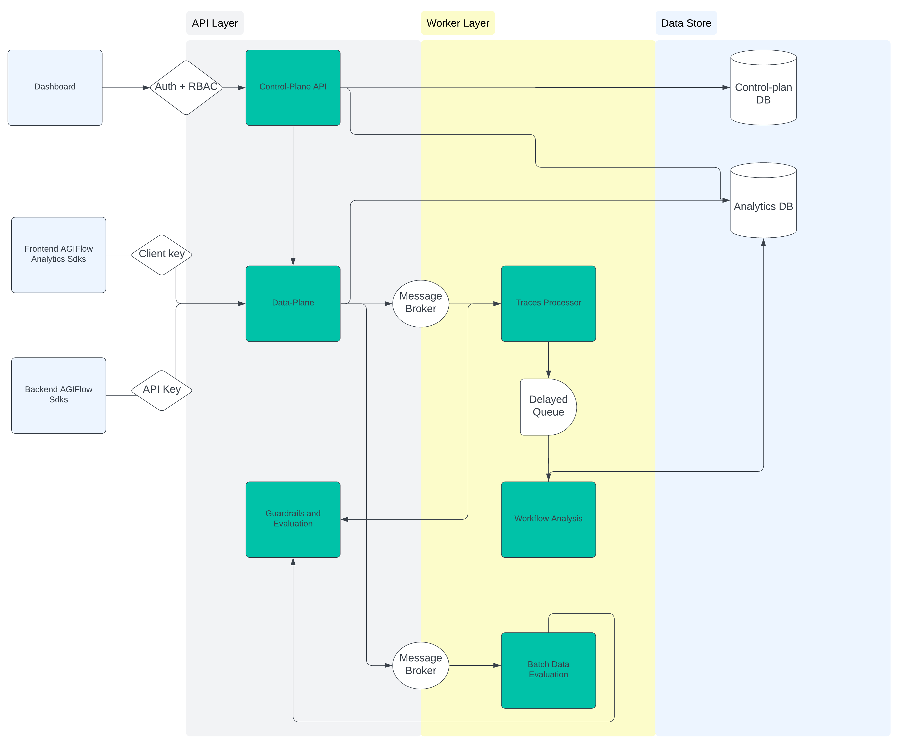

# AGIFlow LLM Ops Platform Architecture Documentation

## Table of Contents

1. [Introduction](#introduction)
2. [Architecture Overview](#architecture-overview)
3. [Components](#components)
   - [Frontend](#frontend)
   - [Backend](#backend)
   - [Message Broker](#message-broker)
   - [Worker](#worker)
4. [Data Flow](#data-flow)
5. [Deployment](#deployment)
6. [Scalability and Fault Tolerance](#scalability-and-fault-tolerance)
7. [Security](#security)
8. [Conclusion](#conclusion)

## Introduction

AGIFlow's LLM Ops Platform is designed to streamline the testing, monitoring and management of Large Language Models (LLMs) apps. This document provides an overview of the architecture, detailing the various components and their interactions within the system. The platform is built using React for the frontend, Node.js and Python for the backend. AGIFlow supports different messaging and queue system during built-time for event-driven architecture; where you can easily self-hosted on your own infrastructure.

## Architecture Overview

The architecture of the AGIFlow Platform is composed of six primary components:

1. **Frontend**: A user interface built with React.
2. **API Layer**: API servers built with Node.js and Python, handling API requests and business logic.
3. **Message Broker**: By default we use Kafka (this component can be swaped to use sns/sqs, etc...), facilitating asynchronous communication between the backend and workers.
4. **Worker Layer**: Nodejs and Python processes performing data processing and model management tasks.
5. **Data Storage**: We use Postgres to store data. Control-plane and analytics data are stored in two separated tables; which we will eventually support other type of datastore for analytics.
6. **Sdks**: Frontend and backend SDKs for analytics, tracing and APIs.

## Components

### Frontend

**Technology**: React, React-query and Tailwind

**Responsibilities**:
- Provide a user-friendly interface for managing LLMs.
- Interact with the backend via RESTful APIs.
- Display real-time status updates and logs.

**Key Features**:
- Dashboard: Overview of system status, LLM performance metrics, and logs.
- Model, Prompt and Data Management: Interface for deploying, updating, and monitoring LLMs.
- Notifications: Real-time alerts for critical events and system status changes.

### API Layer

#### Auth
**Technology**: Supabase Auth 

**Responsibilities**:
- Authenticate user with SAML, SSO support

#### API servers

**Technology**: Node.js, Python

**Responsibilities**:
- Expose RESTful APIs for frontend interaction with Open API documentation.
- Handle business logic and data validation.
- Produce messages to Kafka for worker processing.
- Webhooks for real-time updates and notifications.

**Key Features**:
- User Authorization is based on [Casbin](https://casbin.org/docs/get-started), make it easier to extend and customise Role-base Access Control (RBAC).  
- API Gateway: Unified access point for all backend services.  
- Job Scheduling: Manage and schedule tasks for LLM operations.  

### Message Broker

**Technology**: Kafka as default message broker (support other message brokers and queues via built-time)

**Responsibilities**:
- Facilitate asynchronous communication between the backend and workers.
- Ensure reliable message delivery and processing.
- Handle high throughput and fault-tolerant messaging.

**Key Features**:
- Topic Management: Organize messages into topics for different processing tasks.
- Consumer Groups: Distribute workload among multiple worker instances.
- Persistence: Ensure messages are not lost in transit.

### Worker Layer

**Technology**: Nodejs, Python

**Responsibilities**:
- Consume messages from Kafka.
- Perform data processing and LLM management tasks.
- Send results back to the backend or produce new messages to Kafka.

**Key Features**:
- Model Training and Inference: Handle LLM training and inference tasks.
- Data Preprocessing: Clean and prepare data for model consumption.
- Monitoring and Logging: Track task performance and log results for auditing.

### Data Storage

**Technology**: Postgres

**Responsibilities**:
- Control-plan Database stores data including organization + projects + environments settings, models + prompt registry, dataset.
- Analytics Database stores traces, frontend analytics, session logging, etc...

**Key Features**:
- Postgres is matured and flexible which is perfect fit for current stage of project.
- Analytics Data is stored in a different database so we can support OLAP and other data storage later.

### Sdks

**Technology**: Typescript, Python

**Responsibilities**:
- Use to collect analytics and traces from end-applications.

**Key Features**:
- Fontend sdks provide feedback widget with workflow visualisation mode for power user to help improve LLM.
- Backend sdks is built on top of open-telemetry, support distributed tracing and easy integration.  

## Data Flow

### Control-plan (Dashboard)

1. **User Interaction**: The user interacts with the frontend, performing actions such as evaluating new model.
2. **API Request**: The frontend sends an API request to the backend.
3. **Task Submission**: The backend processes the request, validates the data, and submits a task message to Kafka.
4. **Worker Processing**: A Python worker consumes the message, performs the required task (e.g., model validation), and produces a result message back via webhook to API layers.
5. **Result Handling**: API layers consumes the result message, updates the system state, and sends the response back to the frontend.
6. **User Notification**: The frontend updates the user interface with the latest status and results.

### Control-plan (Dashboard)

1. **User Interaction Analytics**: The user interacts with the end-application frontend, performing actions which call your backend-apis.
2. **API Request**: The frontend sends an API request to the backend, AGIFLow frontend sdks attach `agiflow-x-trace-id` header.
3. **Tracing**: The backend processes the request, use AGIFlow backend sdks to get context from `agiflow-x-trace-id`. Traces are automatically sent to AGIFlow `dataplan API`.
4. **Trace Processing**: Formatting traces and run real-time evaluations if you enable AGIFLow Evaluation plugins. Create deduplicated delayed queue for `tail analysis`.
5. **Workflow Analysis**: Once the trace finalised, run workflow analysis to add metadata to workflow trace and perform aggregation.
6. **User Notification**: If there is issue with real-time evaluations, send websocket notification to fontend sdks so developer can decide what to do with that.

## Deployment
AGIFlow's goal is to provide a scalable LLM Ops platform which can automatically scale as your business growth. With this in mind, we provide a modular layered application which can be easily adapt to your infrastructure need via built-time.

### Infrastructure

- **Frontend**: Deployed on CDN, a web server or cloud service (e.g., Cloudflare, AWS S3 with CloudFront, etc...).
- **Backend**: Deployed on a Node.js server or cloud service (e.g., Cloudflare worker, Azure function, AWS EC2, AWS Lambda, ...).
- **Message Broker**: Use kafka managed service (e.g., Confluent Cloud, AWS MSK) or self-hosted cluster, or switch to sns/sqs and other cloud messaging systems.
- **Workers**: Deployed on serverless container or a container orchestration platform (e.g., Kubernetes, AWS ECS).
- **Data Storage**: Your choice of PostGres instance.

## Scalability and Fault Tolerance

- **Frontend**: Simply use CDN or scaled horizontally with load balancers.
- **Backend**: Using serverless hosting option or scaled horizontally with load balancers and auto-scaling groups.
- **Message Broker**: Use managed-service or cloud messaging system.
- **Workers**: Scaled horizontally with container orchestration platforms.

**Fault Tolerance**:
- Kafka ensures message durability and high availability.
- Backend and worker instances are monitored and restarted on failure.
- Load balancers and health checks ensure service reliability.

## Security

- **Authentication and Authorization**: Secure user access with SSO and RBAC.
- **Data Encryption**: Encrypt data in transit (TLS) and at rest.
- **Network Security**: Use VPCs, firewalls, and security groups to restrict access.
- **Monitoring and Logging**: Implement comprehensive monitoring and logging for security auditing and incident response.

## Conclusion

AGIFlow's LLM Ops Platform leverages modern technologies to provide a robust, scalable, and secure solution for managing Large Language Models. We understand the challenges of bringing your LLM app to production and want to ensure you have a scalable, trustworthy infrastructure to do so.
